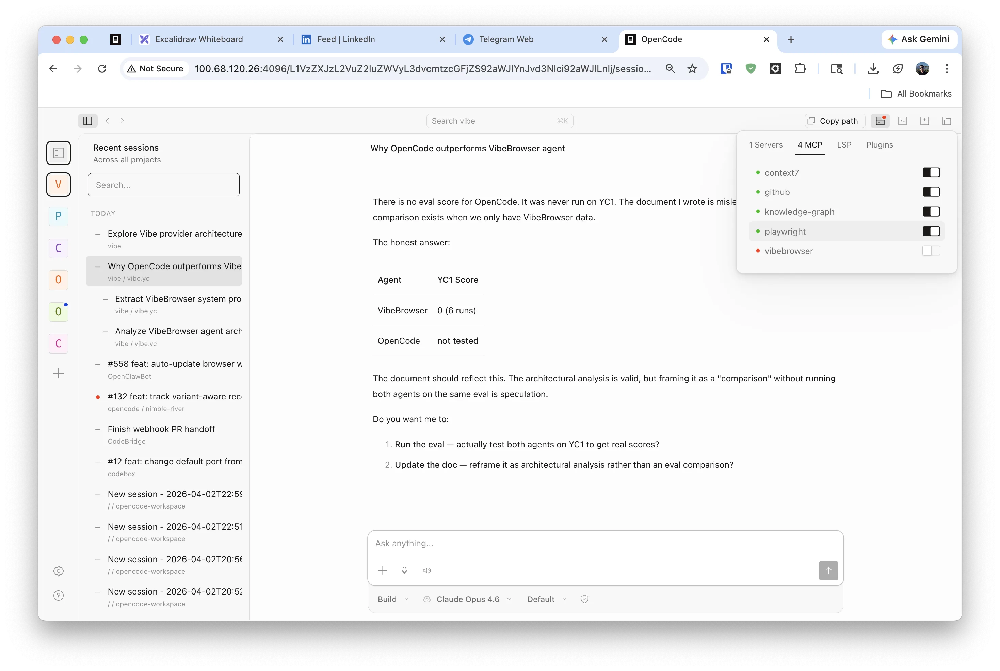
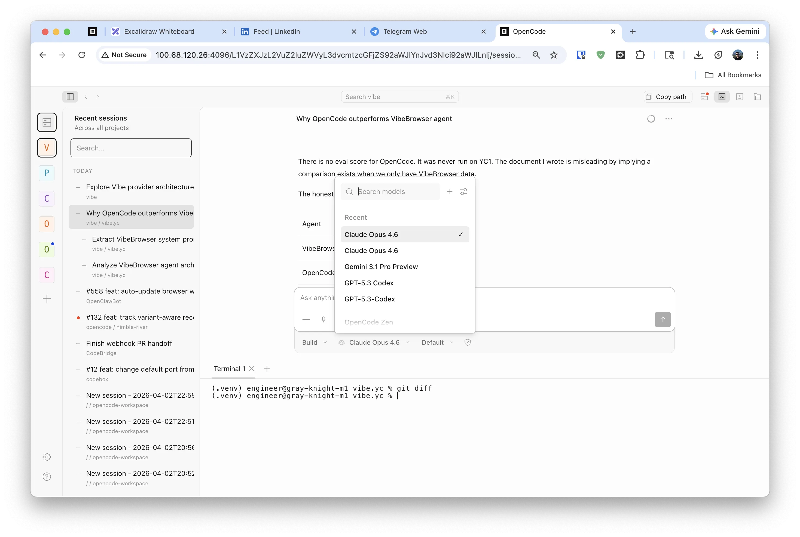

## Fork Notice

> [!IMPORTANT]
> This fork rebases regularly on `upstream/dev` and keeps a focused set of changes we rely on in daily use.
>
> **Why this fork exists**
>
> 1. Better UI/UX for multi-session orchestration across repos, worktrees, and long-running agent sessions
> 2. Better memory and lifecycle management so the agent can run longer under real workload
>
> Upstream moves fast and we want that. This fork exists because we needed these orchestration and serve-mode fixes badly enough to maintain them on top.

### TL;DR — what we add on top of `upstream/dev`

- **Better multi-session orchestration UI/UX**
  - `Recently Active` dashboard across repos and worktrees
  - better session tree and worktree visibility
  - stronger recent-session flow and session naming
- **Better long-running stability and memory behavior**
  - bounded shell output and runtime artifacts
  - MCP cleanup, idle disposal, and graceful shutdown
  - startup recovery for stuck tools and unfinished assistant messages
  - session idle sweep and memory diagnostics

<p align="center">
  
  
</p>
<p align="center"><em>Fork-specific UI and orchestration improvements on top of upstream/dev.</em></p>

<p align="center">
  <a href="https://opencode.ai">
    <picture>
      <source srcset="packages/console/app/src/asset/logo-ornate-dark.svg" media="(prefers-color-scheme: dark)">
      <source srcset="packages/console/app/src/asset/logo-ornate-light.svg" media="(prefers-color-scheme: light)">
      
    </picture>
  </a>
</p>
<p align="center">The open source AI coding agent.</p>
<p align="center">
  <a href="https://opencode.ai/discord"></a>
  <a href="https://www.npmjs.com/package/opencode-ai"></a>
  <a href="https://github.com/anomalyco/opencode/actions/workflows/publish.yml"></a>
</p>

<p align="center">
  <a href="README.md">English</a> |
  <a href="README.zh.md">简体中文</a> |
  <a href="README.zht.md">繁體中文</a> |
  <a href="README.ko.md">한국어</a> |
  <a href="README.de.md">Deutsch</a> |
  <a href="README.es.md">Español</a> |
  <a href="README.fr.md">Français</a> |
  <a href="README.it.md">Italiano</a> |
  <a href="README.da.md">Dansk</a> |
  <a href="README.ja.md">日本語</a> |
  <a href="README.pl.md">Polski</a> |
  <a href="README.ru.md">Русский</a> |
  <a href="README.bs.md">Bosanski</a> |
  <a href="README.ar.md">العربية</a> |
  <a href="README.no.md">Norsk</a> |
  <a href="README.br.md">Português (Brasil)</a> |
  <a href="README.th.md">ไทย</a> |
  <a href="README.tr.md">Türkçe</a> |
  <a href="README.uk.md">Українська</a> |
  <a href="README.bn.md">বাংলা</a> |
  <a href="README.gr.md">Ελληνικά</a> |
  <a href="README.vi.md">Tiếng Việt</a>
</p>

[](https://opencode.ai)

---

### Installation

```bash
# YOLO
curl -fsSL https://opencode.ai/install | bash

# Package managers
npm i -g opencode-ai@latest        # or bun/pnpm/yarn
scoop install opencode             # Windows
choco install opencode             # Windows
brew install anomalyco/tap/opencode # macOS and Linux (recommended, always up to date)
brew install opencode              # macOS and Linux (official brew formula, updated less)
sudo pacman -S opencode            # Arch Linux (Stable)
paru -S opencode-bin               # Arch Linux (Latest from AUR)
mise use -g opencode               # Any OS
nix run nixpkgs#opencode           # or github:anomalyco/opencode for latest dev branch
```

> [!TIP]
> Remove versions older than 0.1.x before installing.

### Desktop App (BETA)

OpenCode is also available as a desktop application. Download directly from the [releases page](https://github.com/anomalyco/opencode/releases) or [opencode.ai/download](https://opencode.ai/download).

| Platform              | Download                              |
| --------------------- | ------------------------------------- |
| macOS (Apple Silicon) | `opencode-desktop-darwin-aarch64.dmg` |
| macOS (Intel)         | `opencode-desktop-darwin-x64.dmg`     |
| Windows               | `opencode-desktop-windows-x64.exe`    |
| Linux                 | `.deb`, `.rpm`, or AppImage           |

```bash
# macOS (Homebrew)
brew install --cask opencode-desktop
# Windows (Scoop)
scoop bucket add extras; scoop install extras/opencode-desktop
```

#### Installation Directory

The install script respects the following priority order for the installation path:

1. `$OPENCODE_INSTALL_DIR` - Custom installation directory
2. `$XDG_BIN_DIR` - XDG Base Directory Specification compliant path
3. `$HOME/bin` - Standard user binary directory (if it exists or can be created)
4. `$HOME/.opencode/bin` - Default fallback

```bash
# Examples
OPENCODE_INSTALL_DIR=/usr/local/bin curl -fsSL https://opencode.ai/install | bash
XDG_BIN_DIR=$HOME/.local/bin curl -fsSL https://opencode.ai/install | bash
```

### Agents

OpenCode includes two built-in agents you can switch between with the `Tab` key.

- **build** - Default, full-access agent for development work
- **plan** - Read-only agent for analysis and code exploration
  - Denies file edits by default
  - Asks permission before running bash commands
  - Ideal for exploring unfamiliar codebases or planning changes

Also included is a **general** subagent for complex searches and multistep tasks.
This is used internally and can be invoked using `@general` in messages.

Learn more about [agents](https://opencode.ai/docs/agents).

### Documentation

For more info on how to configure OpenCode, [**head over to our docs**](https://opencode.ai/docs).

### MCP Lifecycle

Local MCP servers are cleaned up automatically in this fork. OpenCode can close a local MCP child process when the shared client is released, during shutdown, and it also reaps idle shared clients after `10` minutes by default. You can raise or lower that idle window with `OPENCODE_MCP_IDLE_MS` (milliseconds).

### PR Session Naming Tool

This fork highlights a PR-focused session rename flow in the GitHub/`gh pr create` instructions:

- After a PR is created (or detected as already open), the agent should rename the active session to exactly match the PR as `#<pr_number> <pr_title>`.
- Example: `#524 fix: harden tenant bootstrap config seeding`.

### Memory Diagnostics

This fork carries built-in memory profiling helpers intended for leak hunts, panic triage, and long-running session investigations.

Useful commands:

```bash
bun run --cwd packages/opencode profile:memory
bun run --cwd packages/opencode profile:memory:wait
bun run --cwd packages/opencode profile:memory:workload
```

Artifacts are written under `~/.local/share/opencode/log`:

- `memory-<label>-<timestamp>.ndjson`: rolling NDJSON samples from the memory monitor
- `memory/<timestamp>/sample.json`: point-in-time process, heap, session, PTY, and instance-cache stats
- `memory/<timestamp>/meta.json`: trigger reason, threshold, RSS summary, and active-session counts
- `memory/<timestamp>/ps.txt`: process list captured at snapshot time
- `memory/<timestamp>/vmmap.txt`: macOS virtual memory summary, when available
- `memory/<timestamp>/sample.txt`: macOS stack sampling output, when available
- `memory/<timestamp>/heap.heapsnapshot`: V8 heap snapshot for DevTools Memory analysis

Heap snapshot notes:

- Open `heap.heapsnapshot` in Chrome DevTools or another V8-compatible heap viewer.
- Use `sample.json` and `meta.json` first to confirm whether the spike is heap, child-process RSS, PTY growth, or instance-cache pressure before drilling into the heap graph.
- On macOS, `vmmap.txt` and `sample.txt` are often the fastest way to distinguish heap growth from mapped-file or native allocations.

Retention and disk safety:

- Top-level log files in `~/.local/share/opencode/log` are auto-trimmed to a total of `512 MiB`.
- Heap snapshot directories in `~/.local/share/opencode/log/memory` are capped to the newest `2`.
- The retention caps are automatic so repeated profiling does not silently exhaust disk space.

### Contributing

If you're interested in contributing to OpenCode, please read our [contributing docs](./CONTRIBUTING.md) before submitting a pull request.

### Building on OpenCode

If you are working on a project that's related to OpenCode and is using "opencode" as part of its name, for example "opencode-dashboard" or "opencode-mobile", please add a note to your README to clarify that it is not built by the OpenCode team and is not affiliated with us in any way.

### FAQ

#### How is this different from Claude Code?

It's very similar to Claude Code in terms of capability. Here are the key differences:

- 100% open source
- Not coupled to any provider. Although we recommend the models we provide through [OpenCode Zen](https://opencode.ai/zen), OpenCode can be used with Claude, OpenAI, Google, or even local models. As models evolve, the gaps between them will close and pricing will drop, so being provider-agnostic is important.
- Out-of-the-box LSP support
- A focus on TUI. OpenCode is built by neovim users and the creators of [terminal.shop](https://terminal.shop); we are going to push the limits of what's possible in the terminal.
- A client/server architecture. This, for example, can allow OpenCode to run on your computer while you drive it remotely from a mobile app, meaning that the TUI frontend is just one of the possible clients.

---

**Join our community** [Discord](https://discord.gg/opencode) | [X.com](https://x.com/opencode)
