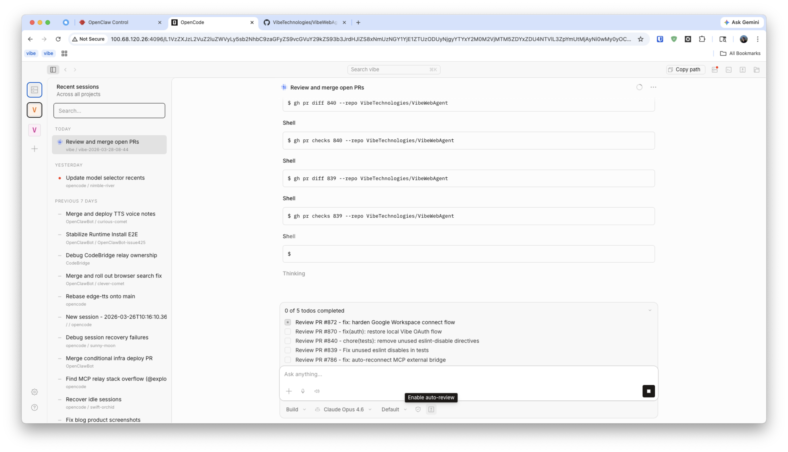

# Operating OpenCode at 8+ Concurrent Sessions: What We Changed

## Context

[OpenCode](https://github.com/anomalyco/opencode) has a client/server model, so we run `opencode serve` on a shared Mac Mini and connect from browser clients across devices.

Our target workload is 8+ concurrent sessions across multiple repositories. Under that load, we observed:

- RSS growth past 2 GB with eventual OOM.
- High write amplification from streaming token persistence.
- No cross-project session control plane in the web UI.
- Manual QA overhead when running autonomous sessions in parallel.

This post documents the changes we made in our fork and the operator value each change provides.

---

## 1. Memory Stability

Upstream memory reports that matched our symptoms: [#17908](https://github.com/anomalyco/opencode/issues/17908), [#17237](https://github.com/anomalyco/opencode/issues/17237), [#12687](https://github.com/anomalyco/opencode/issues/12687), [#15645](https://github.com/anomalyco/opencode/issues/15645).

### 1.1 Batch streaming token writes

Baseline behavior appended per-token deltas to storage via frequent `updatePartDelta` calls. At ~50 tokens/sec across 8 sessions, this produced ~400 tiny writes/sec.

Change:

- Queue deltas per text part.
- Flush every 50ms.
- Join queued chunks once per flush and persist a single combined delta.

Value:

- ~20x reduction in write call volume during streaming.
- Lower event-loop pressure and less transient memory retention.

### 1.2 Bound project instance cache

Baseline behavior retained project `Instance` objects without an effective upper bound. Multi-repo workflows accumulated idle instances.

Change:

- Add LRU eviction for project instances.
- Default cap: `4`.
- Idle and max parameters exposed via `OPENCODE_INSTANCE_MAX` and `OPENCODE_INSTANCE_IDLE_MS`.

Value:

- Bounded steady-state memory for long-running server processes.
- Predictable resource use as repository count grows.

### 1.3 Add idle GC trigger

Baseline behavior depended only on Bun’s automatic GC timing.

Change:

- Track active session processing.
- If no session is active for 5 minutes, trigger `Bun.gc(true)`.

Observed effect in our workload:

- Typical reclaim of 200-400 MB between activity bursts.

### 1.4 Add memory diagnostics endpoint

Change:

- Add `GET /global/memory` endpoint.
- Expose RSS and heap stats, instance cache state, and child process footprint.

Value:

- Faster triage for memory incidents.
- Better signal for alerting and regressions.

---

## 2. Cross-Project Session Orchestration

Per-project sidebars work for single-repo usage but do not scale to multi-repo operations.

Change:

- Add global "Recently Active" dashboard backed by `Session.listGlobal()`.
- Include search, diff stats, and parent/child session tree.
- Add pinned "Recent" tab in sidebar.

Value:

- Lower context-switch time across active sessions.
- Better operator awareness of parallel workstreams.

---

## 3. Mobile Interaction Path

The server model is useful on mobile, but typing long prompts and reading long responses is inefficient.

Change:

- Add server-backed Edge TTS via `POST /tts/edge`.
- Add browser STT via Web Speech API in prompt bar.
- Add per-message playback controls.

Value:

- Lower input/output friction on phones and tablets.
- More practical remote control of long-running sessions.

---

## 4. Autonomous Quality Control

Parallel autonomous sessions increase throughput but can increase review debt.

Change:

- Add optional auto-review mode that queues a "review and reflect" follow-up turn after task completion.

Value:

- Catches defects earlier in the run.
- Reduces manual verification load per session.

---

## Summary

The implementation goal was not feature breadth; it was operational reliability under sustained concurrency:

- Bound memory growth.
- Reduce write amplification.
- Improve session observability.
- Decrease manual QA effort.

## Links

- Fork: [github.com/dzianisv/opencode](https://github.com/dzianisv/opencode)
- Upstream: [github.com/anomalyco/opencode](https://github.com/anomalyco/opencode)
